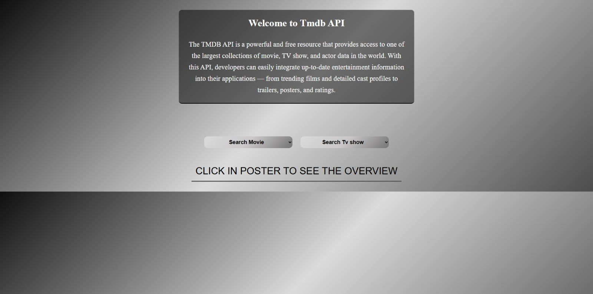
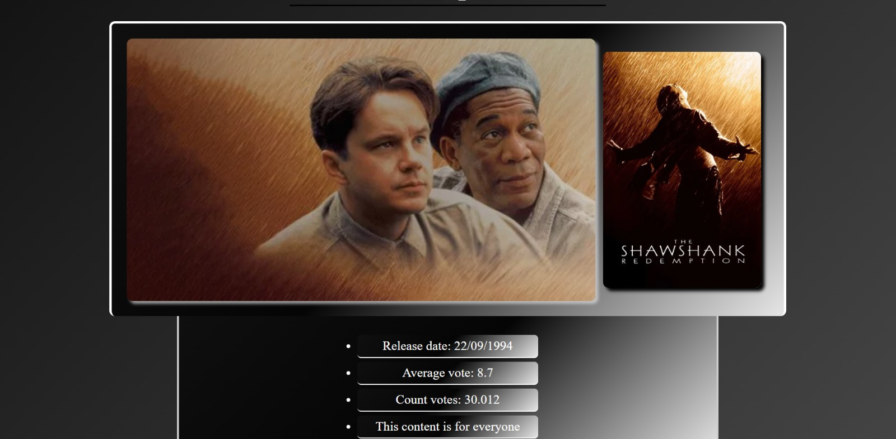
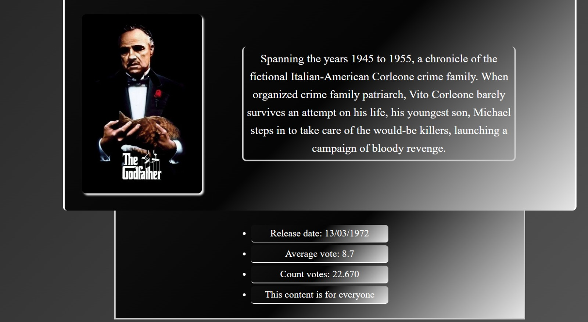

# 🎬 Consumo da API do TMDB


Aplicação web que consome a API do TMDB (The Movie Database) para exibir informações atualizadas sobre filmes e séries, como título, sinopse, nota média, contagem de votos e pôster.

---

## 🌍 Sobre o projeto

O foco principal do projeto é demonstrar o uso prático de requisições HTTP, manipulação de JSON e integração de dados externos em uma aplicação web.

Além disso, o projeto serve como estudo de JavaScript assíncrono — utilizando `fetch()` e `async/await` — e da interação com APIs RESTful, proporcionando uma experiência dinâmica e visualmente agradável para o usuário.

---

## 🖼️ Preview

<div align="center">
  
  
</div>

<div align="center">
  
</div>

---

## 🚀 Funcionalidades

No select o usuário pode escolher:

✔️ Exibição de filmes/séries populares  
✔️ Exibição de filmes/séries mais aclamados  
✔️ Exibição de filmes/séries que estão no ar  
✔️ Exibição de filmes/séries que irão estrear  

Após a opção ser escolhida:

✔️ Exibição do título do filme/série  
✔️ Exibição do pôster e do pano de fundo  
✔️ Exibição da sinopse  
✔️ Exibição da data de lançamento  
✔️ Exibição da nota média  
✔️ Exibição da contagem de votos  
✔️ Indicação se o conteúdo é para maiores de 18 anos  

---

## 🛠️ Tecnologias utilizadas

- HTML5
- CSS3
- JavaScript (Vanilla JS)
- TMDB API

---

## 🎯 Objetivo do projeto

- Praticar consumo de APIs RESTful externas
- Trabalhar com JavaScript assíncrono (`fetch`, `async/await`)
- Manipular e exibir dados JSON de forma dinâmica
- Desenvolver uma interface responsiva e intuitiva

---

🌐 Deploy

Acesse o projeto online:
👉 https://projeto-api-tmdb.vercel.app/

---


## ▶️ Como rodar o projeto

```bash
# Clone o repositório
git clone https://github.com/gabrieldev25789/tmdb-api.git

# Acesse a pasta
cd tmdb-api

# Abra no navegador
index.html
```
